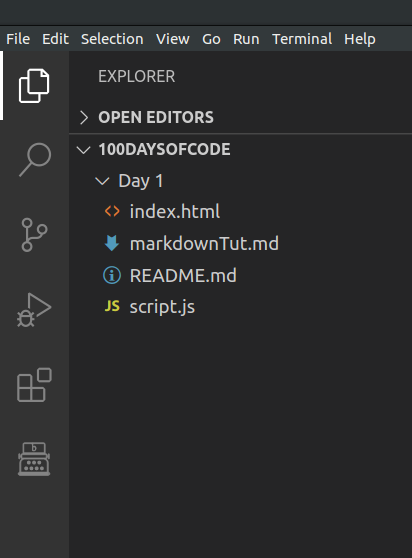
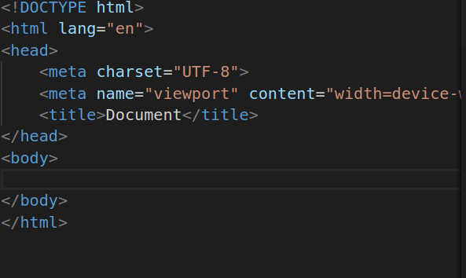

#### JavaScript Basics

__What is JavaScript__ : 
As the ususal definition goes by, JavaScript is high-level, often just-in-time compiled, and multi-paradigm programming language. It has curly-bracket syntax, dynamic typing, prototype-based object-orientation, and first-class functions. 

There are several usage of JavaScript. Some of it's application includes Creation of Front End, Back-end, desktop and Mobile apps. Websites like Spotify, facebook and instagram are built using JavaScript.


__JavaScript Engines__ :
 Main functionality of JavaScript engine is to provide a compiler for JavaScript code without needing to attach it with a browser. In simple words, we can also run JavaScript in our terminal or VSCode editor independently without the help of browser or a HTML file. For example, Node helps us in doing that. Some popular JS engines used by different browsers are :
1. V8 from Google which is  used by browsers like Google Chrome as well as Chromium.

2. SpiderMonkey is developed by Mozilla and used in Firefox browser.

3. JavaScriptCore is developed by Apple and used by it's safari browser.

4. Chakra is JS engine of Internet Explorer broswer.


__ECMAscript__ :
At the beginning of any Web Development class, we are provided with a diagram illustarting the relationship between HTML, CSS and JavaScript. 
Any person with basic knowledge in computer science will say that HTML provides the structure of the web page. CSS is used for styling and JavaScript is used for enhancing the webpage. 

But Javascript is capable of doing way lot of things like DOM manipulation than just enhancing a web page. 

ECMAscript widely known as ES is a general purpose programming language and it also acts as a standard for languages like JavaScript, ActionScript, Nashorn etc. 

To describe it in a easier way, ECMAscript is a set of guidelines that JavaScript follow entirely to implement it's various functionalities in terms of programs or codes. JavaScript is built on top of ECMAscript. 

There are several versions of ECMAscript but most widely used version is ES6 which provided several features like arrows, classes, enhanced object literals, template strings, destruting, generators, unicode, modules and so on. The list along with the code for implementation is provided in the link : https://github.com/lukehoban/es6features#promises


**Step to Write Your First JavaScript Code in VSCode Editor:**
1. Create a directory called Day 1. Inside the Day 1 directory, create two files : index.html and script.js. 

    

2. We don't have to write the entire HTML code because pressing !(exclamation) on the keyboard will provide us with the entire HTML document.
    
    
3. Then we need to include the path of our script.js file inside the body of the HTML document. We do so instead of providing it in the head because after loading the head and everything, JS file will load at the end. 
            format : ``` JavaScript
        
             <script src="./script.js"></script>
         ```

    Here the ./ will provide the relative path or the path of current directory in which the file is present. Also it will provide options of other files present in the current directory.
         ```
    
    ​        

**Variables and Constants in JavaScript** : 

    The difference between variables and constant is that we can change the value of the variables if and when we need to. While in the case of constants, we cannot easily change the value.
    
    In JS the variables are defined using the let keyword. While constants are defined using the const keyword.
    
    If we want to change the value of the constant, it is a better practice to never override it, instead just remove the const keyword.

**Basic Sign up Form using the knowledge of variables:** 

As we must have seen in many sign up forms that we fill in order to access the websites these days, there are certain criterias that needed to be filled in order to login successfully.
Some of those criterias are we have to provide our name, emailID, phone number, password and we have to confirm our password. All these field need to be stored in variables. Most specifically these need to be stored as constants so the user shouldn't be able to change these once entered. But for the sake of simplicity, we are going to store these in variables. 

Unlike many other programming languages, we don't need to define the datatypes of variables in order to store value in them. In JavaScript, we use the var/ let keyword alongside the variable name and store value in it. For example : 

``` javascript
var name = 'Nik'
let name = 'Nik'

```

Var and let keyword has different functionalities when it comes to scope of variables. But that is for later part to dive in. For now, let's just define the above variables for our Signup Form.

``` javascript
var fullName = 'Joey Martin';
var email = 'joey123@gmail.com';
var password = '123ghj';
var confirmPassword = '123ghj';
var phoneNumber = 654789;
var SignedInFromGoogle = false;

```

Here as you can observe, variables like fullName, email, password are strings. PhoneNumber is of interger or number type. There is a new variable declared above called SignedInFromGoogle which is of boolean type. Whenever we land in a signup page, there is an additional option to logIn from our Google or Gmail account. If a user logs in using Gmail, then it will return us true.

Now, how are we going to access the variables. This is done using an in-built javascript function log. 

``` javascript
console.log("Hello World! Happy Learning.")

```

This is going to print *Hello World! Happy Learning*.

There are many ways to print the above variables. We can use + and , operators. For example :

``` javascript
console.log('Name of the new user is' +fullName)
console.log('Email of the new user is' +email)


```

Or 

``` javascript
console.log('Name of the new user is', fullName)
console.log('Email of the new user is', email)


```

You must be wondering whatif I want to print everything in a single line without in a much simpler way than above. Ofcourse you can use \n(newline) and + operator. But an easy way to print it is by using `` instead of "". See the below code to understand :


``` javascript
console.log(`Name of the new user is ${fullName}
Email : ${email}
Phone Number provided by the user : ${phoneNumber}
Has the user signed In through Google account : ${SignedInFromGoogle}
`);


```

This will provide an output of : 

```
Name of the new user is Joey Martin
Email : joey123@gmail.com
Phone Number provided by the user : 654789
Has the user signed In through Google account : false

```

__Operators In JavaScript :__ 

Suppose we want to calculate the discount provided in a particular product, we can easily do so by having a basic knowlege in operators and Math library. 
It's always a better practice to go through the documentation : https://developer.mozilla.org/en-US/docs/Web/JavaScript/Reference/Global_Objects/Math

> __1. Operator Precedence In JavaScript__ : 

Operator precedence is a measure of how the operators are parsed concerning each other. In layman's term, it is to determine which operator would execute in the first place if we are provided with a series of operators.

for Example : In the code snippet ``` console.log(3 + 4 * 5); ``` , according to the famous BODMAS rule, * operator has a higher precedence than the + operator. In similar manner, ``` console.log(4 * 3 ** 2); ``` here ** operator has higher precedence than * operator and hence that operation will be executed in the first place. 

__Precedence and it's relation with Associativity :__

Associativity arises when in the same code snippet, we are provided the same operator multiple times. In that scenario, associativity comes into play and it decided the right side of the code snippet will execute first or the left side. 

But one thing to note is that precedence is greater than associativity. And we can change the associativity by using the () brackets. 

For example : In the code snippet ```console.log(6/2/3);```, it will output 1 because division is left associative which is equal to ```console.log((6/2)/3)```. Whereas if we are talking about ```console.log(2 ** 3 ** 2);``` It will output 512. That is because ** operator is right associative which is equal to ```console.log(2 ** (3 ** 2));```. 

But we can change the associativity using the brackets. For example, ```console.log((2 ** 3) ** 2);``` will output 64.

For knowing more about operator precedence, there is a list provided in the [MDN JavaScript Documentation](http://www.mywebsite.com).